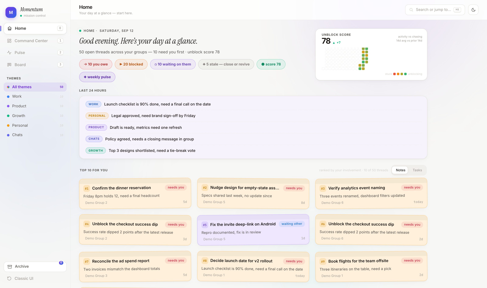
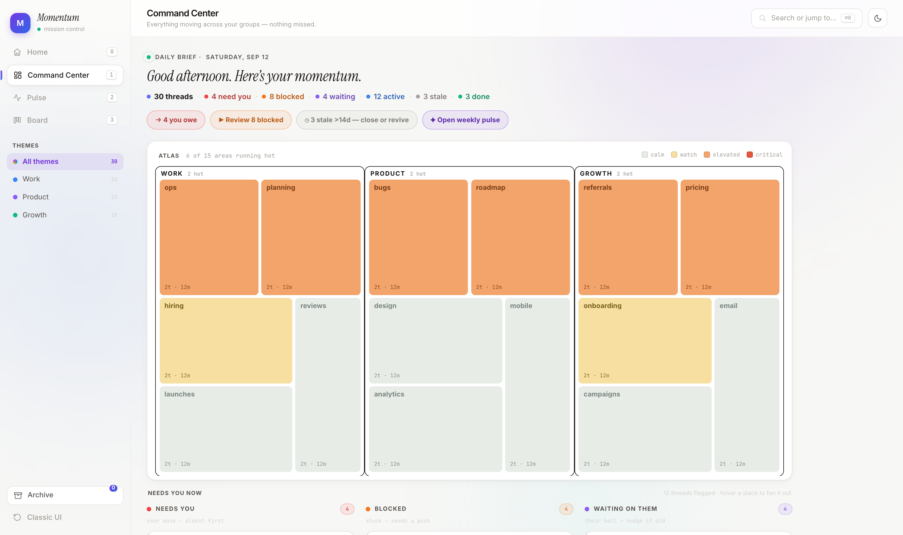
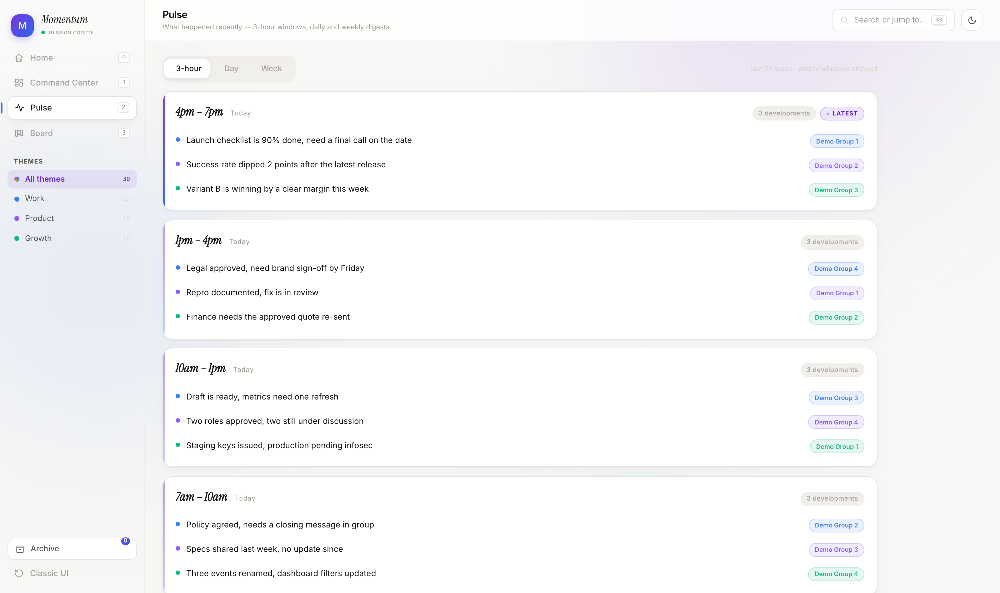
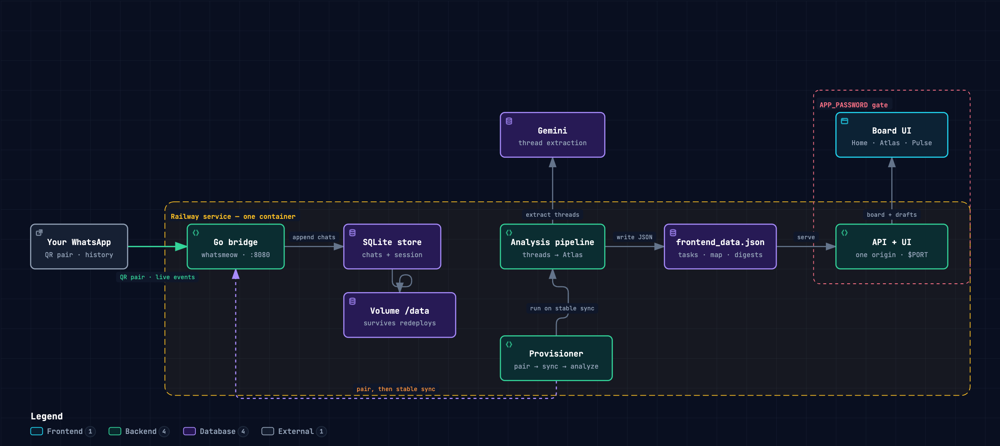

# Momentum — WhatsApp Mission Control

Turns your WhatsApp work groups into a mission-control board: a Home greeting with your top-10 threads, an Atlas treemap of every theme, Pulse digests, and a Kanban board — with AI reply drafts you can send back to any group.

[](https://railway.com/new/template?template=https://github.com/sameer-hoda/momentum&envs=APP_PASSWORD,GEMINI_API_KEY,OWNER_NAME)

No WhatsApp? Set `DEMO_MODE=1` and it boots with a synthetic workspace instead.
All screenshots below are that synthetic demo — zero real chats.

## Views

### Home — your day at a glance
Greeting, live summary pills, last-24-hours recap, and a Top 10 ranked purely by
**your involvement** (your move → you asked → you own it → you raised it → your
messages → nudges), each card showing exactly why it ranks. Flip between
sticky-note and task-table layouts.



### Command Center — Atlas treemap + unblock score
Every theme is a territory, every sub-theme a heat tile (calm → critical).
Crowded territories collapse their tail into a `+N more` strip. The 90-day
unblock wall tracks activity vs friction, with the 14-day average against the
prior 14.



### Pulse — what happened
3-hour bulletin windows, 7 day digests, and one weekly storyline — cross-group,
no noise.



### Board — keep statuses honest
Drag threads between Blocked / In Progress / Completed. Overrides persist;
reset anytime. (Plus the full Command Center thread list with search, filters,
and AI reply drafts you can send back to any group.)

## Architecture

Built with [Archify](https://github.com/tt-a1i/archify) from the actual repo —
explore it live: **[interactive architecture map](https://sameer-hoda.github.io/momentum/architecture.html)**
(search, guided stories, dark/light, export). A copy also lives in
[`docs/architecture.html`](docs/architecture.html).



## How it works

```
Your phone ──QR pair──▶ Go bridge (whatsmeow) ──▶ SQLite (/data/store)
                                                        │
                          provisioner: pair → sync-stable → analyze (Gemini)
                                                        ▼
                        frontend_data.json ──▶ Mission Control UI + API (:PORT)
```

One Railway service, one container, two processes. Chat history persists on a
Volume so redeploys and restarts never lose the session.

## Deploy (5 minutes)

1. Click **Deploy on Railway** above (or: New Project → Deploy from GitHub → this repo).
2. When prompted, set variables:
   - `APP_PASSWORD` — password for the whole UI (required).
   - `GEMINI_API_KEY` — [Google AI Studio](https://aistudio.google.com/) key (recommended; board works heuristically without it).
   - `OWNER_NAME` — your WhatsApp display name, e.g. `Alex Morgan` (powers "needs you" ranking).
3. Add a **Volume**, mount path `/data`. (Without it, sessions and history vanish on every redeploy.)
4. Open the deploy logs, find the QR code, scan with WhatsApp → Settings → **Linked devices**.
5. Open the Railway domain, log in with `APP_PASSWORD`. The boot loader walks through
   **bridge → scan → syncing → analyzing → ready** with live counts. Done.

To re-run analysis later: `POST /api/rebuild` (or the rebuild button, if your UI build has one).

## Local run

```bash
cp .env.example .env   # fill APP_PASSWORD + GEMINI_API_KEY
docker build -t momentum . && docker run -p 8080:8080 \
  -v momentum-data:/data --env-file .env momentum
# → http://localhost:8080  (QR prints to container logs on first run)
```

Demo without WhatsApp: `DEMO_MODE=1` in `.env` and restart.

## Layout

| Path | What |
|---|---|
| `bridge/` | WhatsApp Web bridge (Go + whatsmeow). Upstream by Luke Harries, MIT — see `bridge/UPSTREAM_LICENSE`. Pairing QR prints to stdout. |
| `app/momentum_api.py` | UI + JSON API (stdlib only). Basic-auth via `APP_PASSWORD`. |
| `app/provision.py` | First-boot pipeline: waits for pairing, then for history sync to settle, auto-maps groups into themes, runs the analysis. |
| `app/build_data.py` | Thread extraction → tasks → Atlas map → digests (Gemini, heuristic fallback). |
| `app/export_data.py` | Contact/LID resolution + theme loading shared by the pipeline. |
| `app/demo_seed.py` | Synthetic workspace generator for `DEMO_MODE`. |
| `app/frontend/` | The Mission Control UI (static, fetches `frontend_data.json`). |
| `app/theme_groups.json` | Your theme buckets. Left empty, the provisioner auto-maps every active group into **Chats** — then edit to taste. |

## Security notes

- Never commit `.env`, `*.db`, or `*.log` (already gitignored).
- The bridge API has no auth — it only listens on container localhost and is never exposed.
- Keep `MOMENTUM_LIVE=0` until you trust the send path; dry-run logs every composed message to `sent_log.jsonl` instead of delivering.
- `OWNER_NAME` only tunes ranking/voice; message content never leaves your instance except to the Gemini API for analysis/drafts.
